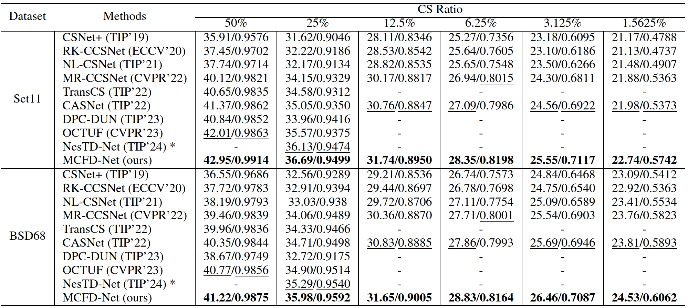

# Multi-Cross Sampling and Frequency-Division Reconstruction for Image Compressed Sensing


## Abstract

Existing CS methods use simple convolutional downsampling and only refer to low-level information in the reconstruction optimization in the information domain, making it difficult to utilize high-level features of the original signal. In deep reconstruction,they ignore the different importance of distinguishing high- and low-frequency information. 
To address the above issues, we propose MCFD Net, which employs a series of clever methods through experiments show that MCFD-Net significantly outperforms state of-the-art CS methods in multiple benchmark datasets while achieving better noise robustness.


## Network Architecture


## Requirements
- Python == 3.10.9
- Pytorch == 1.13.0
- Numpy == 1.16.4


## Datasets
- Train data: [Train_Dataset (GoogleDrive)](https://drive.google.com/file/d/1zUPKz06AhH8zOJBZDtWsxyEHJMt5t-OK/view?usp=drive_link) from COCO 2014 dataset.
- Test data: [Test_Dataset (GoogleDrive)](https://drive.google.com/file/d/1jCwa3PIinC1YtUK4uODCzkqtNl3Z1xjX/view) from Set5, Set11, BSDS200.
- You should decompress and place these datasets in the "./dataset/" directory.

## Pre training model
We provide [pre-trained models (GoogleDrive)](https://drive.google.com/drive/folders/1N-B7NZI0HBHbkTbgZMvNczZpKsP6eDHO?usp=drive_link) for convenient evaluation. It contains six sampling rates.

## How To Run

### Test
1. Ensure the test dataset path in data_processor.py is correct
2. Run the following scripts to test MCFD-Net model:
```
python val.py --sensing-rate 0.015625/0.3125/0.0625/0.125/0.25/0.5
```
3. The default parameter configuration will evaluate the model with a perception rate of 0.5:
```
python val.py
```


### Train

1. Ensure the train dataset path (train_40k) in data_processor.py is correct
2. Run the following scripts to train MCFD-Net model:
```
python train_mcfd.py --sensing-rate 0.015625/0.3125/0.0625/0.125/0.25/0.5 --epochs 200 --batch-size 6
```
1. The default parameters for training are as follows: learning rate = 0.5, batch size = 6, and number of epochs = 200:
```
python train_mcfd.py
```


## Results

### Quantitative Results




### Visual Results


## Contact
If you have any question, please email [gongjy.cs@gmail.com](mailto:xxx@gmail.com).


## Acknowledgements
[TIP-CSNet](https://github.com/wzhshi/TIP-CSNet)
[RK-CCSNet](https://github.com/rkteddy/RK-CCSNet)
[FSOINet](https://github.com/cwjjun/fsoinet)
[MR-CCSNet](https://github.com/fze0012/MR-CCSNet)
